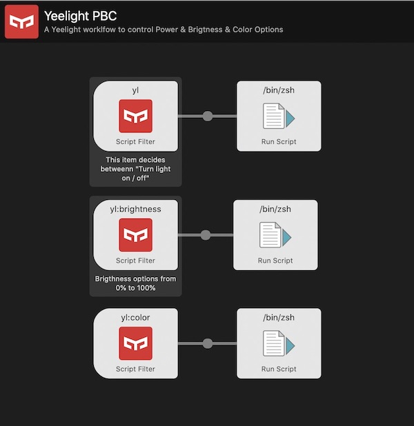

# alfred-yeelight-pbc
 An Alfred Workflow to control Yeelight Bulb with Power / Brightness / Color options

# How to Install?

# How to Use?

# Project ToDo List
- [ ] Adding bulb selection option
- [ ] Adding options for color temperature
- [ ] Adding option to add custom color
- [ ] Managing multiple light bulbs

# Technical Notes
## Code Structure
The file usage is as followed;

- Script filter - **yl** which retrieves lights power status, calls **option.py**
- As result **power.py** is called for turning light on/off action
- Script filter - **yl:brightness** retrieves brightness options by %10 increments and puts current level at the top. Calls **brightness_options.py**
- As result **set_brightness.py** is called for setting light level
- Script filter - **yl:color** is listing color options by calling **color_options.py**
- As result **change_color.py** is called.

**Workflow**

## Other Notes

- Zsh can be changed with bash.
- I'm using bash / zsh to specify which python version will be used instead of predefined python path in Alfed.